# 一些可视化的例子

- [canvas](#canvas)
  * [1.世界新冠疫情图](#1.世界新冠疫情图)
- [webgl](#webgl)
  * [webgl](#webgl)
    + [[1.旋转三角形](./webgl/examples/rotatingTriangle)](#-1--------webgl-examples-rotatingtriangle-)
    + [[2.渐变三角形](./webgl/examples/coloredTriangle)](#-2--------webgl-examples-coloredtriangle-)
    + [[3.使用图像纹理](./webgl/examples/textureQuad)](#-3---------webgl-examples-texturequad-)
    + [[4.基础彩色立方体](./webgl/examples/coloredCube)](#-4----------webgl-examples-coloredcube-)
    + [[5.平行光下的光照模型(环境光 + 漫反射)](./webgl/examples/parallelCube)](#-5-----------------------webgl-examples-parallelcube-)
    + [[6.点光源下的光照模型(环境光 + 漫反射)](./webgl/examples/pointCube)](#-6-----------------------webgl-examples-pointcube-)
    + [[7.多关节模型(手臂)](./webgl/examples/multiJointModel)](#-7------------webgl-examples-multijointmodel-)
    + [[8.基础交互-鼠标控制物体旋转](./webgl/examples/rotateByMouse)](#-8----------------webgl-examples-rotatebymouse-)
    + [[9.基础交互-鼠标选中物体表面](./webgl/examples/pickFaceByMouse)](#-9----------------webgl-examples-pickfacebymouse-)
    + [[10.利用阴影贴图实现阴影](./webgl/examples/shadow)](#-10-------------webgl-examples-shadow-)]
- [threejs](#threejs)
  * [1.github-contributions-3维图像](###[1.github-contributions-3维图像])

## canvas
### 1.世界新冠疫情图
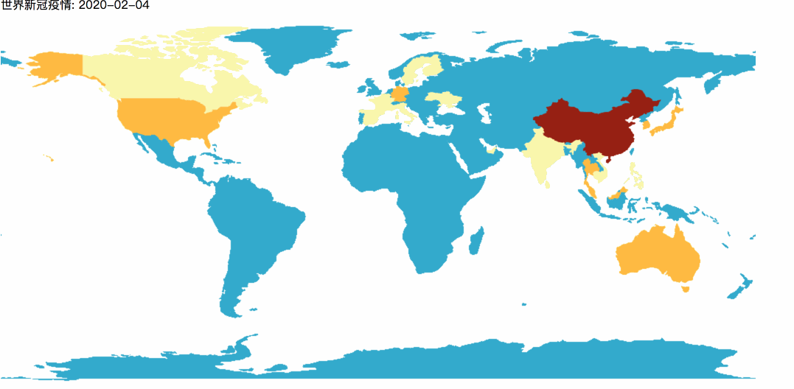
[查看代码](./canvas2d/covid)

## webgl

### [1.旋转三角形](./webgl/examples/rotatingTriangle)
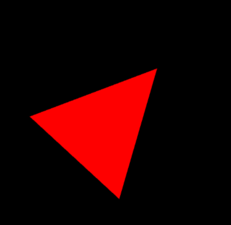

### [2.渐变三角形](./webgl/examples/coloredTriangle)
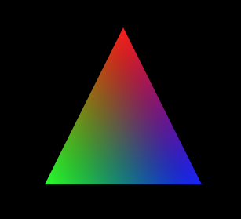

### [3.使用图像纹理](./webgl/examples/textureQuad)
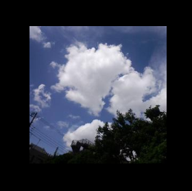

### [4.基础彩色立方体](./webgl/examples/coloredCube)
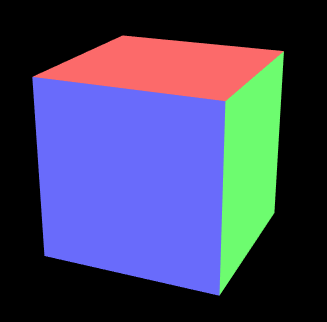

### [5.平行光下的光照模型(环境光 + 漫反射)](./webgl/examples/parallelCube)
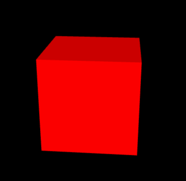

### [6.点光源下的光照模型(环境光 + 漫反射)](./webgl/examples/pointCube)
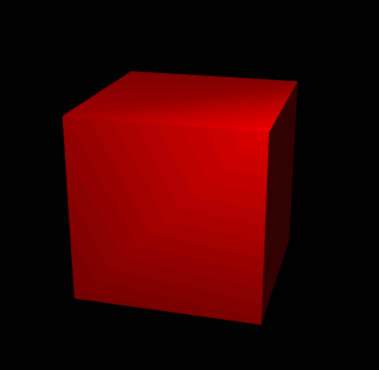

### [7.多关节模型(手臂)](./webgl/examples/multiJointModel)
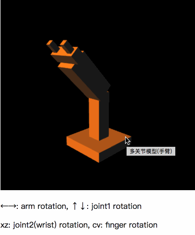

### [8.基础交互-鼠标控制物体旋转](./webgl/examples/rotateByMouse)
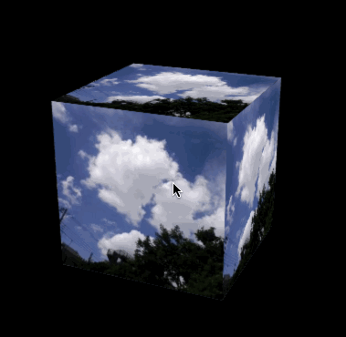

### [9.基础交互-鼠标选中物体表面](./webgl/examples/pickFaceByMouse)
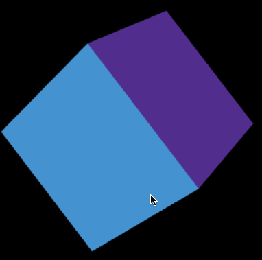

### [10.利用阴影贴图实现阴影](./webgl/examples/shadow)
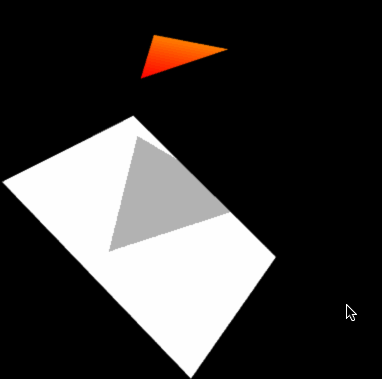

## threejs

### [1.github-contributions-3维图像](./threejs/githubContribution)
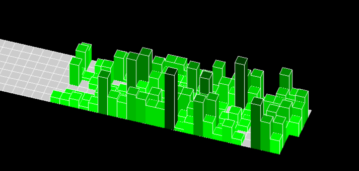

