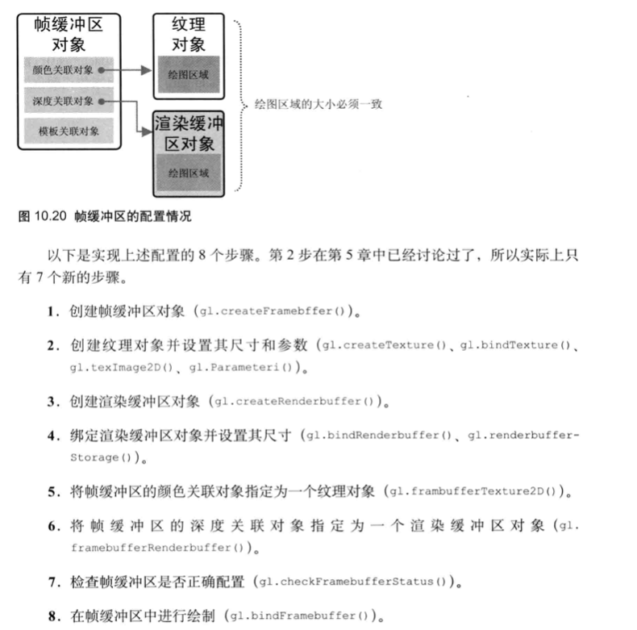

### webgl 绘制工作流

### webgl varying 内插

### 使用纹理
一.设置顶点数据和对应的纹理坐标  
二.将纹理写入到取样器  
1.新建一个纹理对象  
2.激活一个纹理单元，同时将纹理对象绑定到纹理单元上  
3.配置纹理对象参数  
4.将 纹理信息 通过 纹理单元 写入到 纹理对象上  
5.将纹理单元传递给片元着色器声明的取样器上  
三.在片元着色器上通过取样器，属于内插后的纹理坐标，得到对应的颜色  

### 使用帧缓冲区：

### 如何实现阴影：
